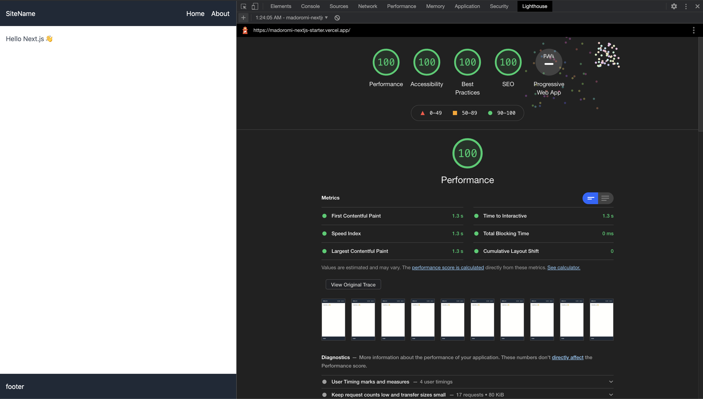

# Next.js starter

## support

- Next.js v10
- typescript
- tailwind
- eslint

## demo

https://madoromi-nextjs-starter.vercel.app



## How to use it?

```
git clone git@github.com:madoromi-inc/nextjs-starter.git
```

### dev

```
npm run dev
```

### build

```
npm run build
```
